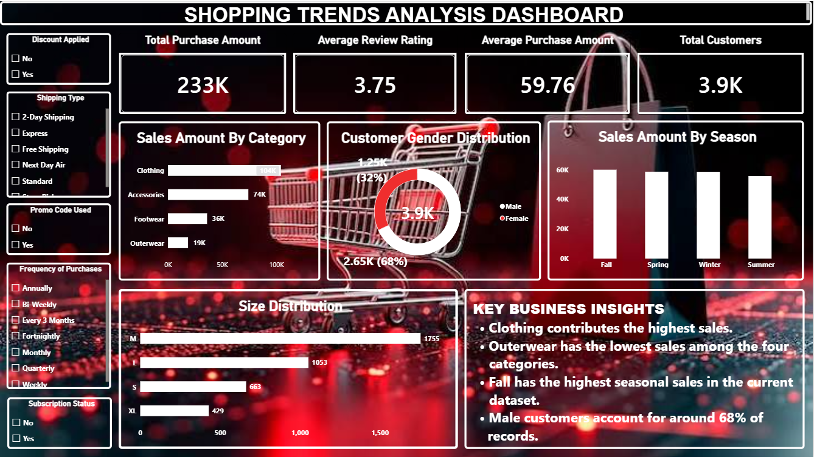

# Shopping Trends Analysis

## Project Overview
This project analyzes customer shopping data to understand purchasing patterns, product category performance, seasonal sales, customer preferences, and spending behavior.

The project uses **Python, SQL, and Excel** to explore the data, perform data quality checks, summarize business performance, and identify findings that can support better business decisions.

## Project Objectives
- Understand customer purchasing patterns and preferences.
- Compare sales across product categories and seasons.
- Analyze customer demographics, sizes, locations, and purchase frequency.
- Check data quality and prepare data for analysis.
- Answer business questions using SQL queries and Python.
- Present findings through Excel analysis, charts, and visualizations.

## Tools and Technologies
- **Python:** Pandas, NumPy
- **Data Visualization:** Matplotlib, Seaborn
- **SQL:** MySQL
- **Spreadsheet Analysis:** Microsoft Excel
- **Development Environment:** Jupyter Notebook

## Dataset Overview
- **Total records:** 3,900
- **Original columns:** 18
- **Main data areas:** Customer demographics, purchased items, product categories, purchase amounts, locations, seasons, ratings, discounts, subscriptions, payment methods, and purchase frequency.

The dataset contains customer and shopping-related information used to explore purchasing behavior.

## Project Workflow

### 1. Data Understanding
- Checked dataset dimensions, column names, data types, unique values, and numerical summaries.
- Reviewed customer, product, and purchase-related information.

### 2. Data Quality Assessment
- Checked for missing values and duplicate records.
- Validated important numerical ranges and categorical values.
- Reviewed customer ID uniqueness and data consistency.

### 3. Data Cleaning and Transformation
- Created a working copy of the dataset in Python.
- Removed duplicate rows where applicable.
- Standardized column names.
- Created additional analysis fields, including age groups and spending levels.

### 4. Exploratory Data Analysis
Analyzed customer demographics, product demand, category sales, seasonal performance, size preferences, location performance, purchase frequency, customer ratings, subscriptions, discounts, and payment methods.

### 5. SQL Analysis
Used SQL to answer business questions with:
- Filtering, sorting, and aggregate functions
- `GROUP BY` and `HAVING`
- Conditional logic using `CASE`
- String and numeric functions
- Subqueries and Common Table Expressions (CTEs)
- Window functions such as `ROW_NUMBER()`, `RANK()`, and `DENSE_RANK()`
- Data quality checks and category-wise, season-wise, and customer-related analysis

### 6. Excel Analysis
The workbook includes:
- Raw data and a data dictionary
- Value analysis and data quality checks
- Cleaned data
- KPI analysis
- Pivot analysis
- Charts and business insights

### 7. Visualization
Used Matplotlib and Seaborn to visualize category purchases, seasonal sales, purchase amount distributions, age groups, subscription status, review ratings, and relationships between numerical variables.

## Key Findings

- **Category performance:** Clothing generated the highest total purchase amount at **$104,264**, while Outerwear generated the lowest at **$18,524**.
- **Seasonal performance:** Fall recorded the highest total purchase amount at **$60,018**. Summer recorded the lowest at **$55,777**.
- **Size preference:** M was the most frequently purchased size, with **1,755 orders** in the SQL analysis.
- **Product demand:** Blouse had the highest purchase count at **171**, while Jeans had the lowest at **124**.
- **Customer demographics:** Male customers represented approximately **68%** of the records, while female customers represented approximately **32%**.
- **Discount analysis:** The average purchase amount was **$60.13** for orders without discounts and **$59.28** for orders with discounts.
- **Subscription analysis:** The average purchase amount was **$59.87** for non-subscribed customers and **$59.49** for subscribed customers.
- **Location performance:** Montana recorded the highest total purchase amount at **$5,784**, while Kansas recorded the lowest at **$3,437**.

*These findings describe the analyzed dataset and should not be treated as proof that a particular factor caused customer behavior.*

## Business Recommendations

1. **Review Clothing inventory:** Maintain suitable stock for Clothing because it has the highest total purchase amount.
2. **Investigate Outerwear performance:** Review product demand, pricing, and customer preferences to identify opportunities for improvement.
3. **Plan seasonal campaigns:** Compare seasonal performance and test targeted campaigns during lower-performing periods, particularly Summer.
4. **Review discount effectiveness:** Compare discount campaigns using order value and other business measures before increasing discount spending.
5. **Improve customer engagement:** Explore ways to engage subscribed customers and evaluate whether those efforts improve purchase behavior.
6. **Monitor location performance:** Investigate differences in order counts and average purchase amounts across locations before deciding where to focus marketing efforts.

## Project Files

- `data/` — Shopping Trends dataset.
- `python/` — Python notebook for data analysis and visualizations.
- `sql/` — SQL queries used to answer business questions.
- `Shopping Trends Analysis.pbix` — Power BI dashboard file.
- `Shopping_Trends_Dashboard.png` — Dashboard preview image.

## Power BI Dashboard

The Power BI dashboard summarizes sales performance, customer
demographics, product categories, and seasonal shopping trends.

**Dashboard Highlights**
- Total Sales
- Total Customers
- Average Purchase Amount
- Average Review Rating
- Sales by Category and Season
- Gender and Size Distribution

**To explore the dashboard:** Download `Shopping Trends Analysis.pbix`
from this repository and open it using Microsoft Power BI Desktop.
## Conclusion
This project demonstrates an end-to-end approach to shopping data analysis using Python, SQL, and Excel. It combines data understanding, data quality checks, exploratory analysis, business queries, and visualization to identify patterns in customer purchasing behavior and product performance.

The project also demonstrates practical skills in data manipulation, SQL analysis, reporting, and communicating data-based findings.

---

**Skills demonstrated:** Data Cleaning | Exploratory Data Analysis | SQL Querying | KPI Analysis | Excel Reporting | Data Visualization | Business Insights

## Power BI Dashboard

The interactive Power BI dashboard provides an overview of sales performance, customer demographics, product categories, and seasonal shopping trends.

**Dashboard Highlights**
- Total Sales
- Total Customers
- Average Purchase Amount
- Average Review Rating
- Sales by Category and Season
- Gender and Size Distribution
